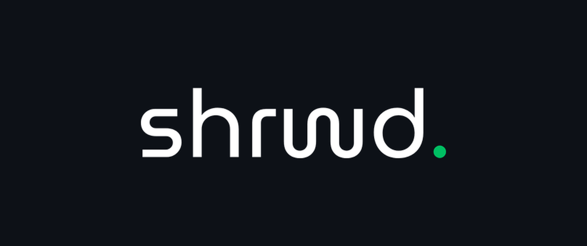

  
  
<strong>Beta Distribution Portal</strong>

---

A web portal for distributing beta builds of the SHRWD React Native app, handling iOS and Android dev builds alongside over-the-air release notes.

## Live demo and access

* **Live site:** https://shrwd-beta.vercel.app
* **Guest access key:** `GUEST-2026`

Guest access opens the dashboard and release history. The alpha tier adds the QR install flow and in-portal feedback, and is issued to the testing group.

The Android build is published as a GitHub release on this repository, so it can be downloaded without a portal session. Binaries live there rather than on Vercel to stay clear of serverless payload limits.

## Technical architecture

This repository contains the web distribution layer. The native mobile application lives in a separate repository.

**Core stack**
* Framework: Next.js (App Router)
* Styling: Tailwind CSS v4
* Hosting: Vercel, with release binaries on GitHub Releases

**Access control**
* Edge middleware gates every route except the sign-in page, so access is checked before server rendering.
* Sessions are httpOnly cookies carrying an HMAC signature, verified on every request, so the access level cannot be altered client-side.
* Passcode attempts are rate limited and compared in constant time.
* The feedback endpoint requires a session and caps payload size.

## About the mobile app

SHRWD is a locally-first personal finance and budgeting application.

* Built with React Native and Expo.
* State management with Zustand.
* Local storage on SQLite, for offline-first performance.

---
*Designed and engineered for the SHRWD beta testing group.*
